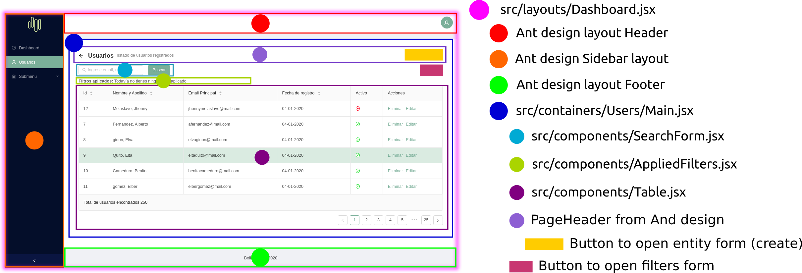
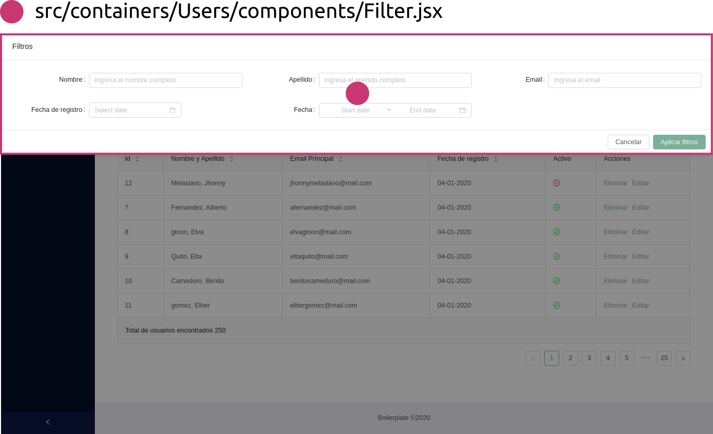
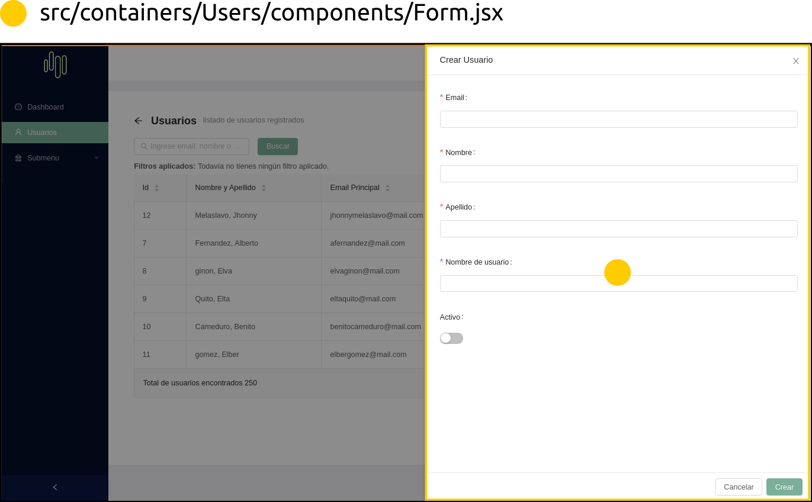

### Local deploy

1. Configure pre-commit
   cp .githooks/pre-commit .git/hooks/pre-commit

2. Copy the environment file
   cp local.env .env

3. Install dependences
   docker-compose run --rm node npm i

4. Start project and make sh
   docker-compose up

# Start project manually

docker-compose run --rm --service-port node bash
npm start

### Manejo de colores y estilos generales parametrizados:

(https://ant.design/docs/react/customize-theme#How-to-do-it)
Valores por defecto: https://github.com/ant-design/ant-design/blob/master/components/style/themes/default.less

Para modificar estos valores se pueden agregar con el mismo nombre de variable dentro del archivo config-override.js

### Link utiles

Paquete para manejar los queryparams
https://github.com/pbeshai/use-query-params

Hooks para usar redux
https://react-redux.js.org/next/api/hooks

Paquete para consumir APIs
https://github.com/axios/axios

Layout base creado con
https://ant.design/components/layout/

Componentes
https://ant.design/components/

Redux ToolKit
https://redux-toolkit.js.org/introduction/quick-start

Redux Tools to develepment
https://github.com/zalmoxisus/redux-devtools-extension

### Structure to create a CRUD from API Rest

|                 Open Filters                  |                Open Form                |
| :-------------------------------------------: | :-------------------------------------: |
|  |  |

## Available Scripts

In the project directory, you can run:

### `yarn start`

Runs the app in the development mode.\
Open [http://localhost:3000](http://localhost:3000) to view it in your browser.

The page will reload when you make changes.\
You may also see any lint errors in the console.

### `yarn test`

Launches the test runner in the interactive watch mode.\
See the section about [running tests](https://facebook.github.io/create-react-app/docs/running-tests) for more information.

### `yarn build`

Builds the app for production to the `build` folder.\
It correctly bundles React in production mode and optimizes the build for the best performance.

The build is minified and the filenames include the hashes.\
Your app is ready to be deployed!

See the section about [deployment](https://facebook.github.io/create-react-app/docs/deployment) for more information.

### `yarn eject`

**Note: this is a one-way operation. Once you `eject`, you can't go back!**

If you aren't satisfied with the build tool and configuration choices, you can `eject` at any time. This command will remove the single build dependency from your project.

Instead, it will copy all the configuration files and the transitive dependencies (webpack, Babel, ESLint, etc) right into your project so you have full control over them. All of the commands except `eject` will still work, but they will point to the copied scripts so you can tweak them. At this point you're on your own.

You don't have to ever use `eject`. The curated feature set is suitable for small and middle deployments, and you shouldn't feel obligated to use this feature. However we understand that this tool wouldn't be useful if you couldn't customize it when you are ready for it.

## Learn More

You can learn more in the [Create React App documentation](https://facebook.github.io/create-react-app/docs/getting-started).

To learn React, check out the [React documentation](https://reactjs.org/).

### Code Splitting

This section has moved here: [https://facebook.github.io/create-react-app/docs/code-splitting](https://facebook.github.io/create-react-app/docs/code-splitting)

### Analyzing the Bundle Size

This section has moved here: [https://facebook.github.io/create-react-app/docs/analyzing-the-bundle-size](https://facebook.github.io/create-react-app/docs/analyzing-the-bundle-size)

### Making a Progressive Web App

This section has moved here: [https://facebook.github.io/create-react-app/docs/making-a-progressive-web-app](https://facebook.github.io/create-react-app/docs/making-a-progressive-web-app)

### Advanced Configuration

This section has moved here: [https://facebook.github.io/create-react-app/docs/advanced-configuration](https://facebook.github.io/create-react-app/docs/advanced-configuration)

### Deployment

This section has moved here: [https://facebook.github.io/create-react-app/docs/deployment](https://facebook.github.io/create-react-app/docs/deployment)

### `yarn build` fails to minify

This section has moved here: [https://facebook.github.io/create-react-app/docs/troubleshooting#npm-run-build-fails-to-minify](https://facebook.github.io/create-react-app/docs/troubleshooting#npm-run-build-fails-to-minify)